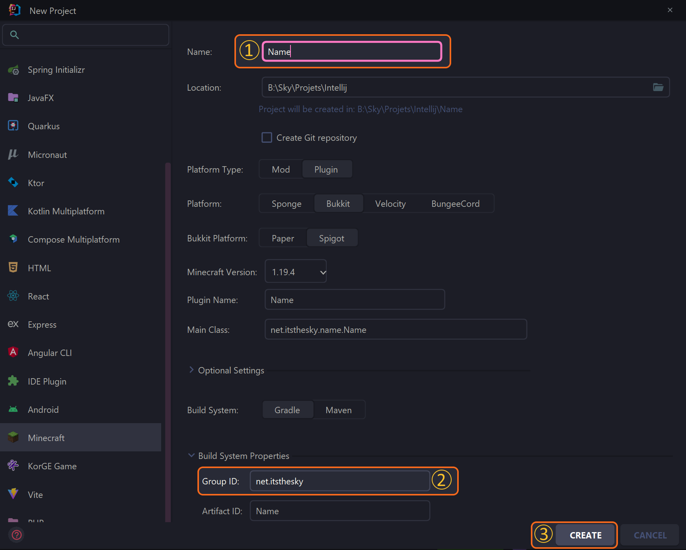
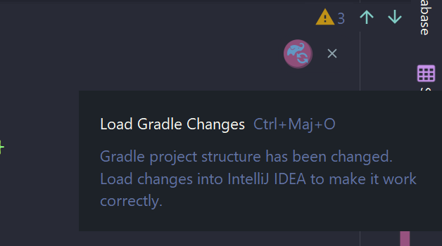

# 📚 Getting Started

This category will describe how to create your own Skript addon, with explanations of the different parts of the addon. It's inspired by [LimeGlass's Addon Tutorial](https://forums.skunity.com/wiki/addon/), although it's not just an updated wiki.

!!! warning
    I assume that you already have an IDE on your computer, as well as basic knowledge of Java.

    I'll be doing a tutorial on how to set up the whole project later, so stay tuned!

!!! info
    We'll use [IntelliJ IDEA](https://www.jetbrains.com/idea/)  for this tutorial, but you can use any IDE you want. The community edition will most likely be enough, but you can use the ultimate edition if you want.

## Create the projet

First, we have to set up a new project. I highly recommend [this plugin](https://mcdev.io/) for IntelliJ to set up a whole Minecraft plugin project for you.

To do so, open IntelliJ IDEA, go under `File > New > Project...`. On the sidebar, look for `Minecraft`. Change the settings so you have something like that:



1. This is the name of your project. It'll be used in-game and as folder name.
2. You can change the package name here, the `Main Class` field should update automatically.
3. Click on 'Create' once you're done.

Then let IntelliJ setup the project & Gradle for you!

## Add Skript as a dependency

In order to use Skript as a dependency, and use it within our project, we must declare it:

1. Open the `build.gradle` file in your project.

2. Locate the `repositories` block section.

3. Adds `maven { url = 'https://repo.skriptlang.org/releases' }` to the list of repositories. It should look like that:

    ```groovy
    repositories {
        mavenCentral()
        // ... Other repositories
        maven { url = 'https://repo.skriptlang.org/releases' }
    }
    ```

4. Locate the `dependencies` block section.

5. Add `compileOnly 'com.github.SkriptLang:Skript:2.6.4'` to the list of dependencies. It should look like that:

    ```groovy
    dependencies {
        // ... Other dependencies
        compileOnly 'com.github.SkriptLang:Skript:2.6.4'
    }
    ```

6. Click on the `Sync` button at the top right of the screen:
    

And here it is!

# Register the addon

Now, we must register the addon & define a package where all our elements will be stored. Open your plugin's main class, and add the following code:

```java
package my.addon;

import org.bukkit.plugin.java.JavaPlugin;

public final class MyAddon extends JavaPlugin {

    @Override
    public void onEnable() {
		
        SkriptAddon addon = Skript.registerAddon(this);//(1)!
		
        addon.loadClasses("...");//(2)!
		
    }
	
}
```

1. This line registers the addon. *tbh, I don't know what it does, but it's needed to register elements*
2. This line loads the classes. You can specify a package name, or a list of classes. If you don't specify anything, it'll load all the classes in the package of the main class.