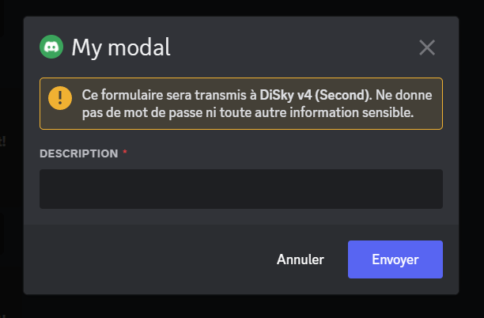

# 🔲 Modals

Modals are a great way to ask for user input via Discord itself. It works like a form, and it's integrated into Discord's UI. We can currently only add **text inputs** to modals, but soon we'll be able to configure checkboxes, dropdowns, and more. 

In this page, we'll see how to create a modal, and handle the user's input.

## Creating a modal

A modal contains the following properties:

- A title, displayed at the top of the modal
- A ID, to identify the modal once the user send a response
- A list of components, that currently only contains text inputs

!!! info
    For now, one modal can contain up to 5 text inputs!

Let's create a modal with a title, and a single text input:

=== "Code"
    ``` { .applescript .annotate }
    # We create the modal
    set {_modal} to a new modal with id "unique-id" named "My modal"
    
    # And then we add a text input to it
    
    set {_input} to new short text input with id "description" named "Description" # (1)
    set placeholder of {_input} to "Input whatever you want here ..."
    
    set minimum range of {_input} to 1 # Minimum length of the input
    set maximum range of {_input} to 30 # Maximum length of the input
    set required state of {_input} to true # Whether the input is required or not
    
    add {_input} to rows of {_modal}
    ```

    1. You can remove the `short` keyword to create a longer input (that'll look like a text area)

=== "Result"
    

Great. As you may notice, we can configure the text input with a few properties:

- The ID, to identify the input once the user send a response
- The name, displayed at the top of the input
- The placeholder, displayed when the input is empty
- The minimum and maximum range of the input (in characters)
- Whether the input is required or not

## Send the modal

A modal can only be sent via **an interaction**. For instance, a slash command or a button click. Here's some example of its usage:

=== "Slash Command"
    ``` { .applescript .annotate }
    on slash command:
        event-string is "mycommand"
        set {_modal} to ... # create the modal
        
        show {_modal} to the user
    ```

=== "Button Click"
    ``` { .applescript .annotate }
    on button click:
        event-string is "mybutton"
        set {_modal} to ... # create the modal
        
        show {_modal} to the user
    ```

!!! info
    As you may notice, we use the `show` expression to send the modal. It can be used in any interaction event.

## Handling the user's response

Once the user has filled the modal and clicked on the "Submit" button, the bot will receive a `on modal receive` event:

``` { .applescript .annotate }
on modal receive:
    event-string is "unique-id" # (1)
    set {_input} to value of text input with id "description" # (2)
```

1. The event-string is the ID of the modal. It's the one configured in the `new modal with id` expression.
2. We can get the value of the text input with its ID. This expression can be used anywhere within the event.

!!! warning
    Although the **modal event** is an interaction, you cannot show another modal in it. If you want to show a modal after the user has filled the previous one, you'll need an 'intermediate' interaction (like a dropdown or a button click).
