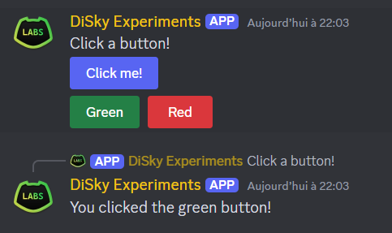
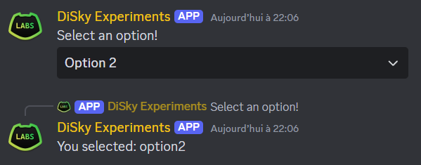
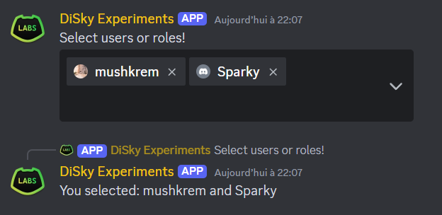

# Components

## Message Buttons

<figure markdown>
  
</figure>

```applescript
# Create a message with buttons
create a new message and store it in {_msg}:
    set content of message to "Click a button!"
    
    # Single button
    add new primary button with id "btn1" named "Click me!" to rows of message
    
    # Multiple buttons in one row
    make new component row and store it in {_row}:
        add new success button with id "btn2" named "Green" to components of row builder
        add new danger button with id "btn3" named "Red" to components of row builder
    add {_row} to rows of message

# Send the message
reply with {_msg}

# Handle button clicks
on button click:
    if event-string is "btn1":
        reply with "You clicked the first button!"
    else if event-string is "btn2":
        reply with "You clicked the green button!"
    else if event-string is "btn3":
        reply with "You clicked the red button!"
```

## String Select Menu

<figure markdown>
  
</figure>

```applescript
# Create a message with a string select menu
create a new message and store it in {_msg}:
    set content of message to "Select an option!"
    
    set {_select} to new dropdown with id "string_select"
    set placeholder of {_select} to "Choose wisely..."
    set min range of {_select} to 1
    set max range of {_select} to 1
    
    add new option with value "option1" named "Option 1" with description "This is the first option" to options of {_select}
    add new option with value "option2" named "Option 2" with description "This is the second option" to options of {_select}
    add new option with value "option3" named "Option 3" with description "This is the third option" to options of {_select}
    
    add {_select} to rows of message

# Send the message
reply with {_msg}

# Handle select menu interactions
on dropdown click:
    if event-string is "string_select":
        set {_selected} to first element of (selected values)
        reply with "You selected: %{_selected}%"
```

## Entity Select Menu

<figure markdown>
  
</figure>

```applescript
# Create a message with an entity select menu
create a new message and store it in {_msg}:
    set content of message to "Select users or roles!"
    
    set {_select} to new entity dropdown with id "entity_select" targeting "users" and "roles"
    set placeholder of {_select} to "Choose users or roles..."
    set min range of {_select} to 1
    set max range of {_select} to 3
    
    add {_select} to rows of message

# Send the message
reply with {_msg}

# Handle entity select menu interactions
on entity dropdown click:
    if event-string is "entity_select":
        set {_selected::*} to selected entities
        reply with "You selected: %{_selected::*}%"
```

## Modal with Text Inputs

<figure markdown>
  
</figure>

```applescript
# Create a button to open the modal
create a new message and store it in {_msg}:
    set content of message to "Click to open the form!"
    add new primary button with id "open_modal" named "Open Form" to rows of message

# Send the message
reply with {_msg}

# Handle button click to open modal
on button click:
    if event-string is "open_modal":
        set {_modal} to new modal with id "example_modal" named "Example Form"
        
        # Short text input
        set {_short_input} to new short text input with id "short_answer" named "Short Answer"
        set placeholder of {_short_input} to "Enter a short response..."
        set minimum range of {_short_input} to 1
        set maximum range of {_short_input} to 100
        set required state of {_short_input} to true
        add {_short_input} to rows of {_modal}
        
        # Paragraph text input
        set {_long_input} to new text input with id "long_answer" named "Long Answer"
        set placeholder of {_long_input} to "Enter a longer response..."
        set minimum range of {_long_input} to 10
        set maximum range of {_long_input} to 1000
        add {_long_input} to rows of {_modal}
        
        # Show the modal
        show {_modal} to event-user

# Handle modal submissions
on modal receive:
    if event-string is "example_modal":
        set {_short_answer} to value of text input with id "short_answer"
        set {_long_answer} to value of text input with id "long_answer"
        
        reply with "Short answer: %{_short_answer}%%nl%Long answer: %{_long_answer}%"
```