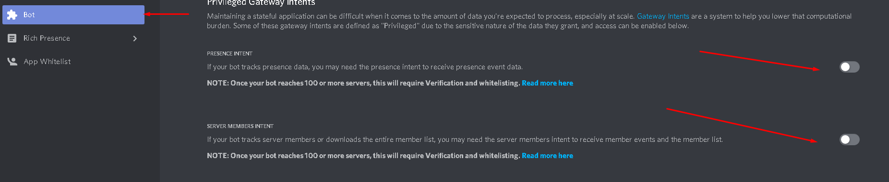

# ❓ Frequently Asked Questions (FAQ)

This page contains answers to frequently asked questions about DiSky. If you have a question that is not answered here, please join [our Discord server](https://disky.me/discord)!

??? question "Even after an hour, slash commands aren't updated / deleted / added. Why?"
    You need to enable the "applications.commands" scope when you invite your bot to a guile. Without it the bot can't manage slash command

??? question "Why does my bot doesn't log on? Why I am getting a CloseCode (4014 / Disallowed intents error)?"
    You need to enable your bot intents at the bot page in discord developers to fix this issue
    

??? question "a types.discordentity cannot be stored i.e. the content of the variable {x} will be lost when the server stops"
    The entity is not serializable, therefore skript cant save it neither yml.
    Instead, you can save its ID and then get it back using the different getting expressions.