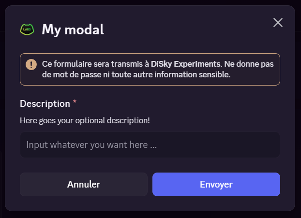

# Modals

Modals are a great way to ask for user input via Discord itself. It works like a form, and it's integrated into Discord's UI. We can currently only add **text inputs** to modals, but soon we'll be able to configure checkboxes, dropdowns, and more. 

In this page, we'll see how to create a modal, and handle the user's input.

## Creating a modal

A modal contains the following properties:

- A title, displayed at the top of the modal
- A ID, to identify the modal once the user send a response
- A list of components

!!! info
    The way a modal's structure work is as follows:
    
    - Each component is either a **label** or a [**text display**](../interactions/componentsv2.md#text-display)
    - A label, besides its title/description, will contain a **child**, which is either a **text input** or **dropdown**

Let's create a modal with a title, a text input and a choice dropdown:

=== "Code"
    ``` { .applescript .annotate }
    # Create the modal
    set {_modal} to new modal with id "feedback-form" named "Bot Feedback Form"

    # Create a short input for the title
    set {_title} to new short text input with id "title" with value "Feedback: "
    set placeholder of {_title} to "Enter a brief title for your feedback"
    set minimum range of {_title} to 3
    set maximum range of {_title} to 50
    set required state of {_title} to true

    # Each (interactive) component must have a label (THAT label is the one added to the modal)
    set {_titleLabel} to new label "Feedback Title" with {_title} with description "We'd love to hear your thoughts!"
    
    # Create a longer input for the description
    set {_desc} to new text input with id "description" with value "This%nl%Is%nl%A new line :O"
    set placeholder of {_desc} to "Please provide detailed feedback about the bot..."
    set minimum range of {_desc} to 10
    set maximum range of {_desc} to 1000
    set required state of {_desc} to true

    set {_descLabel} to new label "Detailed Feedback" with {_desc} with description "Your detailed feedback helps us improve!"

    # Create a dropdown for rating
    set {_dp} to new dropdown with id "rating"
    set min range of {_dp} to 1
    set max range of {_dp} to 1
    set placeholder of {_dp} to "Select a rating..."

    add new option with value "5" named "5 Star" with description "You loved this thing!" with reaction "⭐" to options of {_dp}
    add new option with value "4" named "4 Star" with description "You liked this thing!" with reaction "⭐" to options of {_dp}
    add new option with value "3" named "3 Star" with description "It was okay." with reaction "⭐" to options of {_dp}
    add new option with value "2" named "2 Star" with description "You didn't like this thing." with reaction "⭐" to options of {_dp}
    add new option with value "1" named "1 Star" with description "You hated this thing!" with reaction "⭐" to options of {_dp}

    set {_ratingLabel} to new label "Your Rating" with {_dp} with description "How would you rate your experience?"
    
    # We can also add text display directly!
    set {_t} to new text display "### [Butterfly Fields](https://sky-children-of-the-light.fandom.com/wiki/Daylight_Prairie#Butterfly_Fields)%nl%Text on another line? Yea it works, but it's better to just add a new text :)" with unique id 1000

    # Add components to the modal.
    # For text inputs/dropdowns, you must wrap them into a label first! Text display may be added directly.
    add {_t} to rows of {_modal}

    add {_titleLabel} to rows of {_modal}
    add {_descLabel} to rows of {_modal}
    add {_ratingLabel} to rows of {_modal}
    ```

    1. You can remove the `short` keyword to create a longer input (that'll look like a text area)

=== "Result"
    

Great. As you may notice, we can configure the text input with a few properties:

- The ID, to identify the input once the user send a response
- The placeholder, displayed when the input is empty
- The minimum and maximum range of the input (in characters)
- Whether the input is required or not

In addition, we can also configure the label with a title and an optional description.

!!! tips "Did you notice?"
    In this case only, you may define a `required state` for **dropdowns!**

## Send the modal

A modal can only be sent via **an interaction**. For instance, a slash command or a button click. Here's some example of its usage:

=== "Slash Command"
    ``` { .applescript .annotate }
    on slash command:
        event-string is "mycommand"
        set {_modal} to ... # create the modal
        
        show {_modal} to the user
    ```

=== "Button Click"
    ``` { .applescript .annotate }
    on button click:
        event-string is "mybutton"
        set {_modal} to ... # create the modal
        
        show {_modal} to the user
    ```

!!! info
    As you may notice, we use the `show` expression to send the modal. It can be used in any interaction event.

## Handling the user's response

Once the user has filled the modal and clicked on the "Submit" button, the bot will receive a `on modal receive` event. 

Keep in mind the ID used for each interactive component:

- Text inputs will return single string 
- Dropdowns will **always** return an array/a list of strings (even if you only selected one option, or min/max is set to 1)

``` { .applescript .annotate }
on modal receive:
    event-string is "unique-id" # (1)
    
    # Get the values from the inputs
    set {_title} to value of text input with id "title"
    set {_desc} to value of text input with id "description"

    # dropdown may returns an array; in our case (min/max is 1) it will always be a single value array
    set {_rating::*} to value of dropdown with id "rating"
    set {_rating} to first element of {_rating::*}
            
    # Simple validation for the rating
    if {_rating} parsed as number is not between 1 and 5:
        reply with hidden ":x: Rating must be between 1 and 5!"
        stop
        
    # go on with your datas ...
```

1. The event-string is the ID of the modal. It's the one configured in the `new modal with id` expression.

The result of the code above will look like this:

<figure markdown>
  
  <figcaption>Result of the code above</figcaption>
</figure>

!!! warning
    Although the **modal event** is an interaction, you cannot show another modal in it. If you want to show a modal after the user has filled the previous one, you'll need an 'intermediate' interaction (like a dropdown or a button click).
