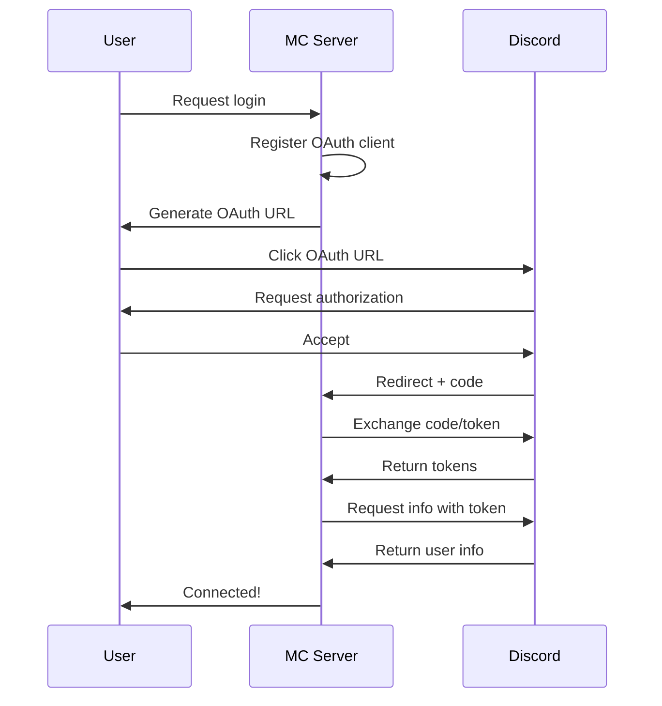

# DiSkyOAuth Introduction

DiSkyOAuth is a module for DiSky that simplifies Discord OAuth2 authentication integration into your scripts. It allows users to connect to your application through Discord and access their information such as:

- Profile information (email, Discord subscription type, etc.)
- Server list
- Detailed user information

## Discord Limitations

Discord's OAuth2 API imposes certain restrictions:

- Applications must request specific **scopes** to access certain information
- Some scopes like `email` require application verification by Discord
- Rate limit is 50 requests per second per application
- Access tokens expire after 7 days
- Requests must be authenticated with a client ID and client secret

## Features

DiSkyOAuth automatically handles:

- Authentication URL generation
- Authorization code reception and validation
- Code for access token exchange
- User information retrieval
- Secure token storage

All of this is exposed through a simple and intuitive Skript API.

# Configuration

## Server Configuration

DiSkyOAuth starts a local web server to receive Discord's OAuth2 responses. Configuration is done in the `plugins/DiSky/modules/DiSkyOAuth/config.yml` file:

```yaml
# The port where the redirect web server will be used. This port
# must be open, free and accessible from the internet!
port: 16334

# The url to redirect in case someone tries to access the root of the server.
# This is useful to redirect users to the support server or the website.
redirect-url: "https://disky.me/"

# The full, accessible (so NOT localhost) URL to the server.
# It must also include the port.
# This URL must be added to your Discord application's OAuth2 redirect URIs
server-url: "http://localhost:16334"
```

## Website Customization

DiSkyOAuth provides a default success page that users will see after authentication. You can find and customize these files in:
```
plugins/DiSky/modules/DiSkyOAuth/website/
```

Feel free to modify the HTML, CSS, and any other assets to match your server's branding.

## Available OAuth2 Scopes

Here are the main OAuth2 scopes available from Discord and what information they provide:

| Scope | Description | Returns | Suported by DiSkyOAuth |
|-------|-------------|----------|----------|
| `identify` | Get user info without email | username, discriminator, avatar, etc. |
| `email` | Get user's email | email address |
| `guilds` | List user's guilds | list of basic guild objects |
| `guilds.join` | Add user to a guild | requires additional permissions |
| `bot` | Add bot to servers | not useful for OAuth |
| `connections` | Get linked third-party accounts | Twitch, YouTube, etc. |
| `guilds.members.read` | Get user's roles and nicknames | detailed guild member info |
| `role_connections.write` | Update user's connection | metadata about connection |

!!! warning "Verification Requirements"
Some scopes like `email` and `guilds.join` require your application to be verified by Discord if your bot is in 100+ servers. See the [Discord Verification Requirements](https://support-dev.discord.com/hc/en-us/articles/6275923204375) for more details.

## Discord Configuration

1. Go to the [Discord Developer Portal](https://discord.com/developers/applications)
2. Create a new application
3. Note down the **Client ID** and **Client Secret**
4. In the OAuth2 tab:
    - Add your redirect URL (`server-url`) to the authorized redirections
    - Select the necessary scopes:
        - `identify` - For basic information
        - `email` - For email address
        - `guilds` - For server list

!!! warning "Redirect URL"
The redirect URL configured in config.yml must match **exactly** the one configured on the Discord portal.

## Installation

1. Download DiSkyOAuth from [DiSky Resources](https://patreon.disky.me/)
2. Place the .jar file in `plugins/DiSky/modules/`
3. Restart your server
4. Configure the config.yml file as shown above

# Usage

## OAuth2 Workflow



## Complete Example

Here's a complete OAuth2 authentication example:

```applescript
# OAuth client registration
on load:
    register oauth client named "my-client" with id "CLIENT_ID" with secret "CLIENT_SECRET" with scopes "identify" and "email" using bot "my-bot"

# Command to start auth
discord command login:
    trigger:
        # Generate authentication URL
        set {_url} to oauth url of client "my-client"
        
        # Send URL to user 
        reply with "Click here to login: %{_url}%"

        # Wait for OAuth response
        wait for oauth request with client "my-client":
            
            # Get info
            set {_user} to oauth user
            set {_email} to user's email
            set {_premium} to user's premium type
            
            reply with "**Login successful!**%nl%Email: `%{_email}%`%nl%Type: `%{_premium}%`"

# Global OAuth event
on oauth request:
    broadcast "%event-user% logged in via OAuth!"
    broadcast "Servers: %join user's guilds with ", "%"
```

## Best Practices

1. **Security**
    - NEVER share your Client Secret
    - Store tokens securely
    - Always verify required scopes

2. **Error Handling**
    - Use try/catch to handle errors
    - Inform users of failures
    - Check logs for issues

3. **Performance**
    - Limit API requests
    - Cache user information
    - Don't block the main thread

## Available Event Values

When using the `on oauth request` event, you have access to:

- `event-bot` - The bot used for OAuth
- `event-user` - The authenticated user
- `user's email` - User's email address (requires scope)
- `user's premium type` - User's Discord Nitro status
- `user's guilds` - List of user's guilds (requires scope)