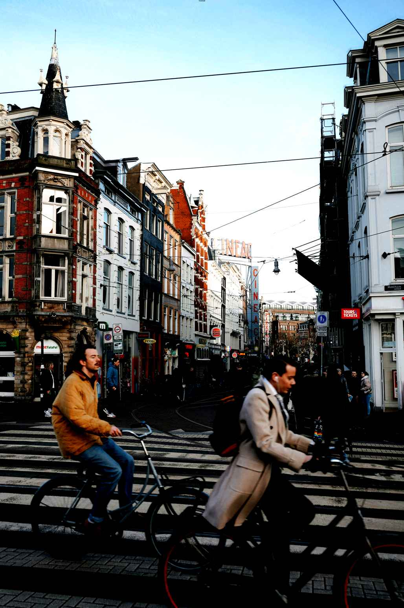
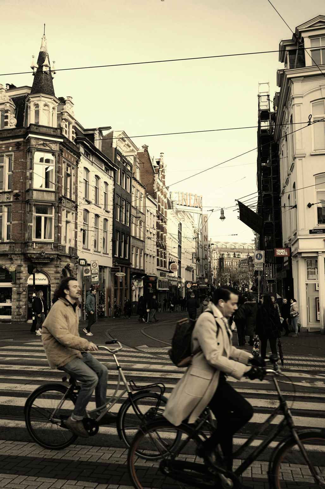
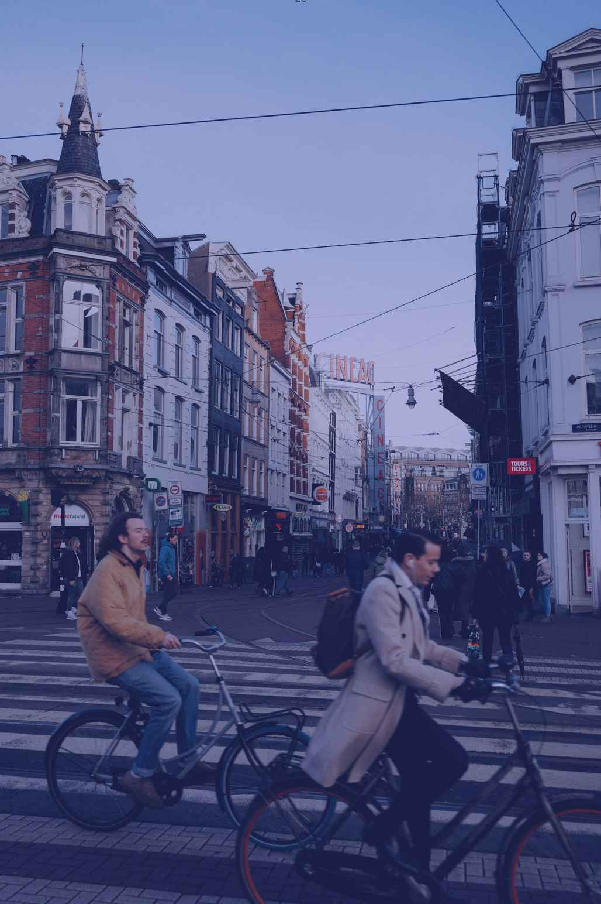
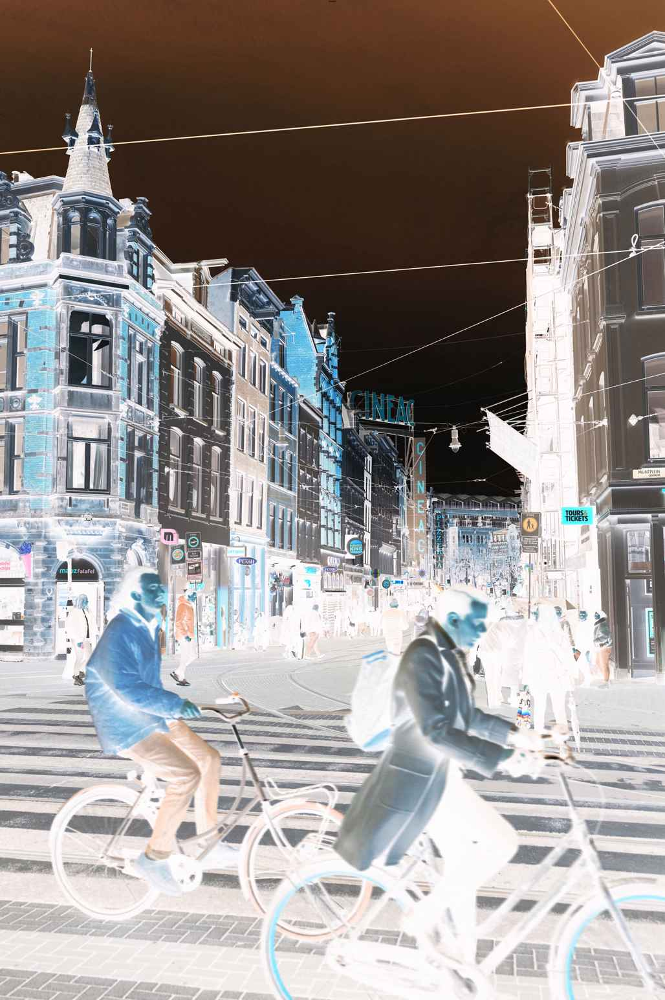

# Image Effects

SkImage2 provides a powerful set of image effects that can be applied to images to transform their appearance. These effects can be combined to create complex visual transformations.

!!! tip "Performance Consideration"
    Image effects can be processing-intensive, especially for large images. If you have DiSky installed, it's highly recommended to use the `await set {_img} ...` prefix for effect operations to prevent server lag.

## Applying Effects

You can apply an effect to an image using the following syntax:

```applescript
set {_img} to {_img} with effect {_effect}
```

You can also chain multiple effects:

```applescript
set {_img} to {_img} with effects {_effect1} and {_effect2}
```

## Available Effects

### Blur Effect

Creates a gaussian blur effect that softens the image.

```applescript
set {_effect} to blur effect with radius 5
set {_img} to {_img} with effect {_effect}
```

The `radius` parameter determines how strong the blur is. Higher values create a more pronounced blur effect.

=== "Original"
    {: style="width:400px;"}
=== "With Blur Effect"
    {: style="width:400px;"}

### Brightness Effect

Adjusts the brightness of an image.

```applescript
set {_effect} to brightness effect with factor 1.5
set {_img} to {_img} with effect {_effect}
```

The `factor` parameter:
- Values greater than 1.0 increase brightness
- Values less than 1.0 decrease brightness
- A factor of 1.0 maintains the original brightness

=== "Original"
    {: style="width:400px;"}
=== "Increased Brightness (+40%)"
    .png){: style="width:400px;"}
=== "Decreased Brightness (-40%)"
    .png){: style="width:400px;"}

### Contrast Effect

Adjusts the contrast of an image.

```applescript
set {_effect} to contrast effect with factor 1.5
set {_img} to {_img} with effect {_effect}
```

The `factor` parameter:
- Values greater than 1.0 increase contrast
- Values less than 1.0 decrease contrast
- A factor of 1.0 maintains the original contrast

=== "Original"
    {: style="width:400px;"}
=== "With Contrast Effect"
    {: style="width:400px;"}

### Grayscale Effect

Converts an image to grayscale (black and white).

```applescript
set {_effect} to grayscale effect with intensity 0.8
set {_img} to {_img} with effect {_effect}
```

The `intensity` parameter (0.0 to 1.0) controls how much of the original color is removed:
- 1.0 creates a fully grayscale image
- 0.0 leaves the image unchanged
- Values in between create a partial grayscale effect

=== "Original"
    {: style="width:400px;"}
=== "With Grayscale Effect"
    {: style="width:400px;"}

### Sepia Effect

Applies a warm brown tone to the image, creating a vintage or aged look.

```applescript
set {_effect} to sepia effect with intensity 0.7
set {_img} to {_img} with effect {_effect}
```

The `intensity` parameter (0.0 to 1.0) controls the strength of the sepia effect.

=== "Original"
    {: style="width:400px;"}
=== "With Sepia Effect"
    {: style="width:400px;"}

### Color Tint Effect

Applies a color tint to the image.

```applescript
set {_effect} to color tint effect with color red and intensity 0.3
set {_img} to {_img} with effect {_effect}
```

Parameters:
- `color`: The color to apply as a tint (can be a Skript color or RGB value)
- `intensity`: How strongly the color is applied (0.0 to 1.0)

=== "Original"
    {: style="width:400px;"}
=== "Red Tint"
    {: style="width:400px;"}
=== "Blue Tint"
    {: style="width:400px;"}
=== "Green Tint"
    {: style="width:400px;"}

### Invert Effect

Inverts the colors of the image, creating a negative-like effect.

```applescript
set {_effect} to invert effect with intensity 0.8
set {_img} to {_img} with effect {_effect}
```

The `intensity` parameter controls how strongly the inversion is applied.

=== "Original"
    {: style="width:400px;"}
=== "With Invert Effect"
    {: style="width:400px;"}

### Pixelate Effect

Creates a blocky, pixelated appearance by reducing image detail.

```applescript
set {_effect} to pixelate effect with pixel size 8
set {_img} to {_img} with effect {_effect}
```

The `pixel size` parameter determines the size of the "pixels" created. Larger values create a more pronounced pixelation effect.

=== "Original"
    {: style="width:400px;"}
=== "With Pixelate Effect"
    {: style="width:400px;"}

### Composite Effect

Combines multiple effects into a single operation, applied in sequence.

```applescript
set {_grayscale} to grayscale effect with intensity 0.7
set {_blur} to blur effect with radius 3
set {_composite} to composite effect with effects {_grayscale}, {_blur}
set {_img} to {_img} with effect {_composite}
```

=== "Original"
    {: style="width:400px;"}
=== "With Grayscale + Blur Effect"
    {: style="width:400px;"}

## Examples

Here are some practical examples of using image effects:

### Creating a Vintage Photo Effect

```applescript
# Load the image
set {_img} to image from file "path/to/image.jpg"

# Create the vintage effect
set {_sepia} to sepia effect with intensity 0.8
set {_vignette} to color tint effect with color black and intensity 0.2
set {_contrast} to contrast effect with factor 1.2

# Apply the effects
set {_img} to {_img} with effects {_sepia} and {_contrast} and {_vignette}

# Save the result
save image {_img} to "path/to/vintage_image.jpg"
```

### Creating a Dreamy, Soft Effect

```applescript
# Load the image
set {_img} to image from file "path/to/image.jpg"

# Create the dreamy effect
set {_brightness} to brightness effect with factor 1.1
set {_blur} to blur effect with radius 2
set {_tint} to color tint effect with color (color from rgb 150, 180, 255) and intensity 0.15

# Apply the effects
set {_img} to {_img} with effect {_brightness}
set {_img} to {_img} with effect {_blur}
set {_img} to {_img} with effect {_tint}

# Save the result
save image {_img} to "path/to/dreamy_image.jpg"
```

### Creating a High-Contrast Black and White Image

```applescript
# Load the image
set {_img} to image from file "path/to/image.jpg"

# Create the high-contrast B&W effect
set {_grayscale} to grayscale effect with intensity 1.0
set {_contrast} to contrast effect with factor 1.5

# Apply the effects (using await for performance)
await set {_img} to {_img} with effect {_grayscale}
await set {_img} to {_img} with effect {_contrast}

# Save the result
save image {_img} to "path/to/high_contrast_bw.jpg"
```

### Creating a "Glitch" Effect

```applescript
# Load the image
set {_img} to image from file "path/to/image.jpg"

# Create the glitch effect components
set {_pixelate} to pixelate effect with pixel size 3
set {_contrast} to contrast effect with factor 1.3
set {_invert} to invert effect with intensity 0.3

# Apply the effects
await set {_img} to {_img} with effects {_pixelate} and {_contrast} and {_invert}

# Save the result
save image {_img} to "path/to/glitch_image.jpg"
```

## Tips and Best Practices

1. **Performance Management**:
   - Use `await` before effect operations for large images when DiSky is installed
   - Apply multiple effects at once using composite effects when possible
   - Consider downsizing large images before applying complex effects

2. **Effects Sequencing**:
   - The order of effects matters! Applying a blur after a color effect will give different results than doing it in reverse
   - Experiment with different sequences to achieve the desired look

3. **Intensity Control**:
   - For most effects, using subtle intensity values (0.3-0.7) often gives more pleasing results than extreme values
   - You can always apply the same effect multiple times to gradually build up the desired strength